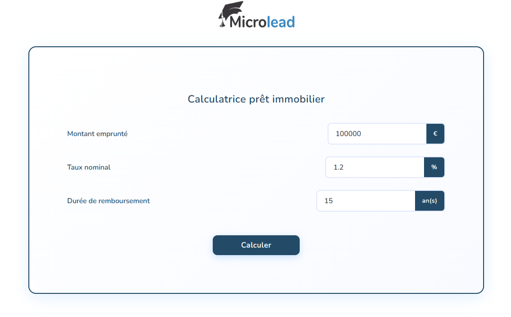
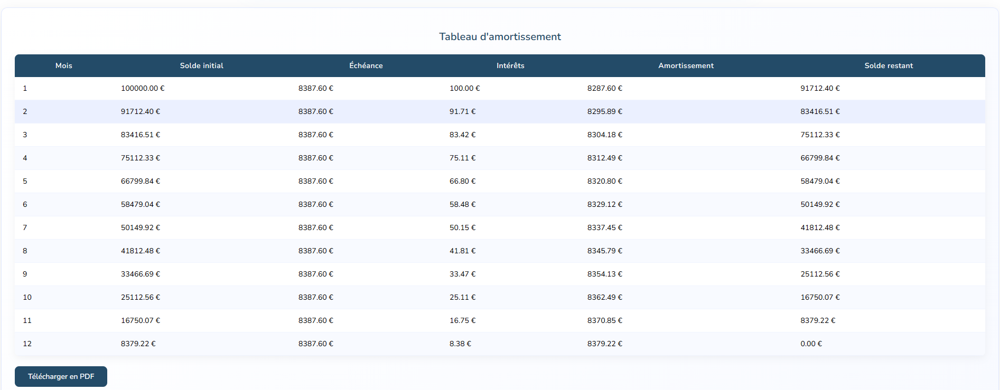

# **🏠 Calculatrice Prêt Immobilier**  
Une calculatrice moderne et intuitive pour simuler les mensualités et générer le tableau d'amortissement complet d'un prêt immobilier :  
  
  
## **✨ Fonctionnalités**  
* **Calcul automatique** des mensualités et intérêts
* **Tableau d'amortissement complet** mois par mois
* **Export PDF** du tableau d'amortissement
* **Interface moderne** avec design responsive
* **Validation des données** en temps réel  
## **🚀 Démonstration**  
[Voir la démo en ligne](https://www.youtube.com/watch?v=jdkSxWxZiFk)  
## **📋 Prérequis**  
Aucun prérequis particulier ! Le projet fonctionne directement dans un navigateur web moderne.  
## **🛠️ Installation**  
1. **Cloner le repository**  
``` bashgit clone https://github.com/GuillaumeGOIZET/Calculator ```  
``` cd calculatrice-pret-immobilier ```  
2. **Ouvrir le projet**  
* Ouvrez le fichier ``` index.html ``` dans votre navigateur
* Ou utilisez un serveur local (Live Server, XAMPP, etc.)  
## **📁 Structure du projet**  
calculatrice-pret-immobilier/  
├── index.html              (Page principale)  
├── style.css               (Styles CSS)  
├── scripts/  
│   └── main.js             (Logique JavaScript)  
├── images/  
│   └── logo_microlead.png  (Logo de l'entreprise)  
│   └── Screenshot_HomePage_Calculator.png (Capture d'écran de la page d'accueil)  
│   └── Screenshot_ArrayPage_Calculator.png (Capture d'écran de la page du tableau d'amortissement)  
└── README.md               (Documentation)  
## **🎯 Utilisation**  
1. **Saisir les informations du prêt :**  
* Montant emprunté (en euros)
* Taux nominal annuel (en %)
* Durée de remboursement (en années)  
2. **Cliquer sur "Calculer"** pour générer le tableau d'amortissement  
3. **Télécharger le PDF** pour sauvegarder ou imprimer le tableau  
## **📊 Calculs effectués**  
La calculatrice utilise les formules financières standard :  
* **Mensualité** = Capital × [Taux mensuel / (1 - (1 + Taux mensuel)^(-Nombre de mois))]
* **Intérêts mensuels** = Capital restant × Taux mensuel
* **Amortissement** = Mensualité - Intérêts
* **Capital restant** = Capital précédent - Amortissement  
## **🛠️ Technologies utilisées**  
* **HTML5** - Structure de la page
* **CSS3** - Styling moderne avec dégradés et animations
* **JavaScript (Vanilla)** - Logique métier et interactions
* **jsPDF** - Génération de fichiers PDF
* **jsPDF-AutoTable** - Création de tableaux dans le PDF
* **Google Fonts (Nunito)** - Typographie moderne  
## **🎨 Fonctionnalités CSS**  
* Design responsive (mobile-first)
* Dégradés et ombres modernes
* Animations fluides
* États de hover et focus
* Palette de couleurs cohérente  
## **📱 Compatibilité**  
* ✅ Chrome (recommandé)
* ✅ Firefox
* ✅ Safari
* ✅ Edge
* ✅ Mobile (iOS/Android)  
## **🔧 Personnalisation**  
### **Modifier les couleurs**  
Dans ``` style.css ```, ajustez les variables de couleur :  
``` css ```  
_``` /* Couleurs principales */ ```_  
``` --primary-blue: #234B68; ```  
``` --background: #f8faff; ```  
### **Ajouter des champs**  
1. Ajoutez le champ HTML dans ``` index.html ```
2. Récupérez la valeur dans ``` main.js ```
3. Intégrez-la dans les calculs  
### **Personnaliser le PDF**  
Modifiez les styles dans la fonction ```autoTable() ``` :  
``` javascriptheadStyles: { ```  
   ``` fillColor: [44, 90, 160], // Couleur d'en-tête ```  
   ``` textColor: [255, 255, 255], ```  
``` }, ```  
## **🐛 Résolution de problèmes**  
### **Le PDF ne se télécharge pas**  
* Vérifiez que les bibliothèques jsPDF sont bien chargées
* Ouvrez la console (F12) pour voir les erreurs
* Testez sur un autre navigateur  
### **Les calculs semblent incorrects**  
* Vérifiez que tous les champs sont remplis
* Utilisez le point (.) comme séparateur décimal
* Les taux doivent être en pourcentage (ex: 1.5 pour 1,5%)  
### **Problèmes d'affichage**  
* Actualisez la page (Ctrl+F5)
* Vérifiez que tous les fichiers CSS sont chargés
* Testez sur différentes tailles d'écran  
## **🤝 Contribution**  
Les contributions sont les bienvenues ! Pour contribuer :  
1. Fork le projet
2. Créez une branche feature (``` git checkout -b feature/nouvelle-fonctionnalite ```)
3. Committez vos changements (``` git commit -m 'Ajout nouvelle fonctionnalité' ```)
4. Push sur la branche (``` git push origin feature/nouvelle-fonctionnalite ```)
5. Ouvrez une Pull Request  
## **📄 Licence**  
Ce projet est sous licence MIT. Voir le fichier LICENSE pour plus de détails.
## **👥 Auteurs**
* **Guillaume GOIZET** - *Développement initial* - [My GitHub](https://github.com/GuillaumeGOIZET)  
## **🙏 Remerciements**  
* **jsPDF** pour la génération PDF
* **Google Fonts** pour la typographie
* **Microlead** & **@kevinniel** pour le design et les spécifications  
## **📞 Support**  
Pour toute question ou suggestion :  
* Ouvrez une [issue](https://github.com/GuillaumeGOIZET/Calculator/issues)
* Contactez-moi à : [goizetg@gmail.com](mailto:goizetg@gmail.com)  
>⭐ N'hésitez pas à donner une étoile si ce projet vous a été utile !  
>🚨 **Disclaimer** : Les calculs sont fournis à titre indicatif. Consultez un professionnel pour des conseils financiers détaillés.